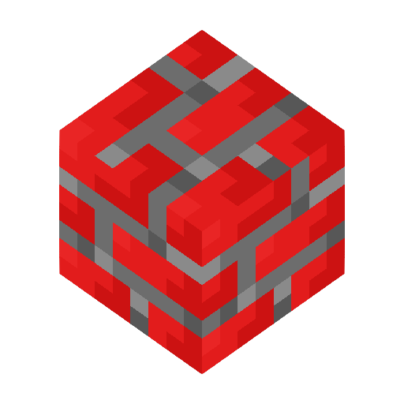

	<h1> Graphics Engine </h1>
	
 Graphics Engine written in C++ using GLFW, OpenGL, STB image and GLM 

	

### Features
- Multi-platform windowing system
- 3 dimensional OpenGL/Vulkan graphics API rendering system with simple lighting (Directional light, spot light and point light) 
- Simple Image texture support (Nearest filter)
- Basic 3 dimensional camera system with perspective projection
- Multiple meshes support (Cube, plane)
- Basic input system for controlling window and graphics rendering

### Future Plans
- Add advanced OpenGL graphics API rendering
- Update Vulkan graphics API rendering
- Add more meshes support (Sphere, etc)
- Add simple/advanced user interface with Dear ImGui
- Add advanced and flexible input system with mouse and keyboard input
- Add audio system using openAL audio API
- Fully automate libraries package finding and installation with CMake

### Credits
- This Graphics Engine project follows [VictorGordan's Youtube OpenGL tutorial playlist](https://youtube.com/playlist?list=PLPaoO-vpZnumdcb4tZc4x5Q-v7CkrQ6M-&si=UxJGYZ8omvecyZBD) and [LearnOpenGL tutorial](https://learnopengl.com/). Huge shoutout to them
- For more information about contributors and their roles. Please refer to [CREDITS.md](CREDITS.md)

### License
- For more information about license. Please refer to [LICENSE.txt](LICENSE.txt)
