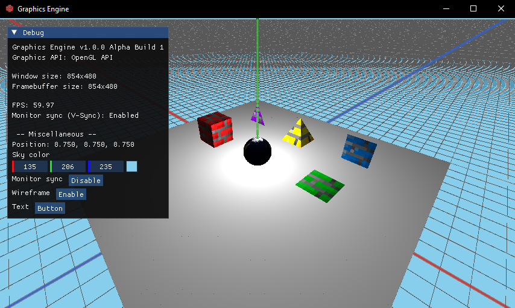

	<h1> Graphics Engine </h1>
	<h3> Minimal graphics engine written in C++ </h3>
	
 Using GLFW, GLAD OpenGL, STB image, GLM and more 

	
	
	
	
	 
	

### Features
- Multi-platform windowing system
- 3 dimensional OpenGL graphics API rendering system with simple lighting (Directional light, spot light and point light)
- Simple mesh rendering (Cube, sphere, pyramid, plane, quad and triangle)
- Simple image texture support (Nearest filter, 4 color channels)
- Basic 3 dimensional camera system with projections (Perspective and orthographic) and rotations (Euler and quaternion)
- Basic input system for controlling window and graphics rendering
- Simple user interface rendering
- Automate libraries package searching

### Future Plans
- Add advanced OpenGL graphics API rendering
- Add and update Vulkan graphics API rendering
- Add support for multiple graphics API rendering (OpenGL, Vulkan, Direct3D, Metal, etc.)
- Add advanced user interface with Dear ImGui
- Add advanced and flexible input system with mouse and keyboard input
- Add audio system using openAL
- Fully automate libraries package finding and installation with CMake

### Minimum Requirements
- [C++23](https://cppreference.com/cpp/23)
- [GCC 14 or later](https://gcc.gnu.org/), [Clang 18 or later](https://clang.llvm.org/), or [Microsoft Visual C++ (MSVC) 17.10 or later](https://learn.microsoft.com/en-us/cpp/overview/acquire-msvc?view=msvc-170)
- [CMake 3.20 or later](https://cmake.org/)

### Screenshot

	

Screenshot taken: 2026-08-05 04:59:48 UTC (2026-08-05T04:59:48Z)

### How to use
- Clone the repository using `git clone` command
- Run `Build.py` using Python. For platform specific, run `Build.bat` (Microsoft Windows) or  `Build.sh` (Unix/Linux)
- Once the project is successfully built, it should be ready to go

### Contributing
- For further details about contributions. Please check [CONTRIBUTING.md](CONTRIBUTING.md)

### Credits
- This Graphics Engine project follows [VictorGordan's Youtube OpenGL tutorial playlist](https://youtube.com/playlist?list=PLPaoO-vpZnumdcb4tZc4x5Q-v7CkrQ6M-&si=UxJGYZ8omvecyZBD) and [LearnOpenGL tutorial](https://learnopengl.com/). Huge shoutout to them
- For more details about contributors and their roles. Please check out [CREDITS.md](CREDITS.md)

### License
- For more information about license. Please review [LICENSE.txt](LICENSE.txt)
